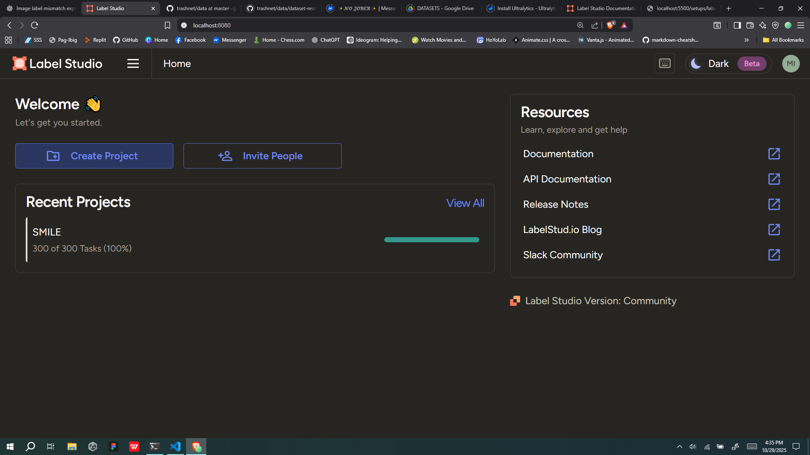
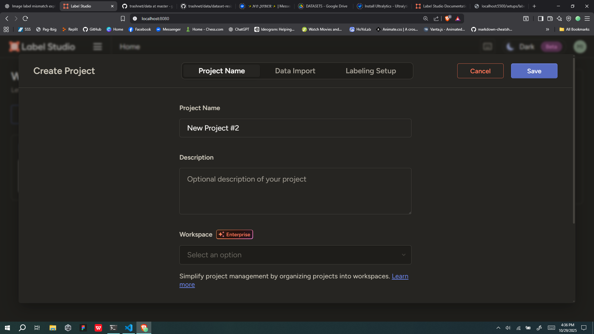
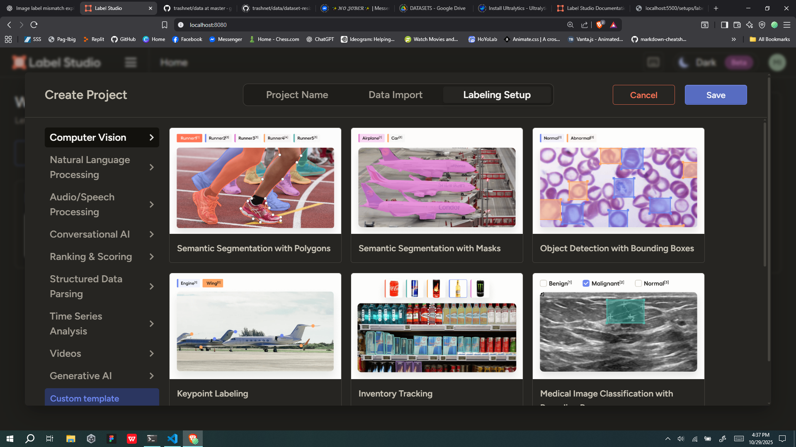
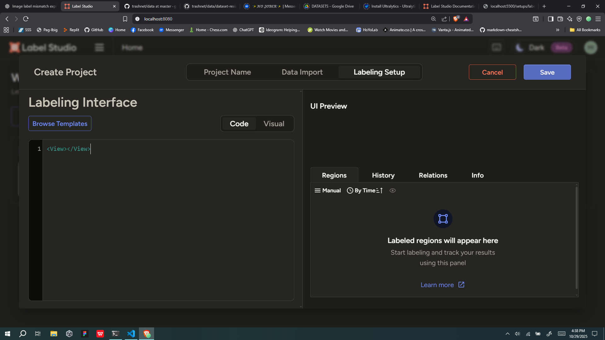
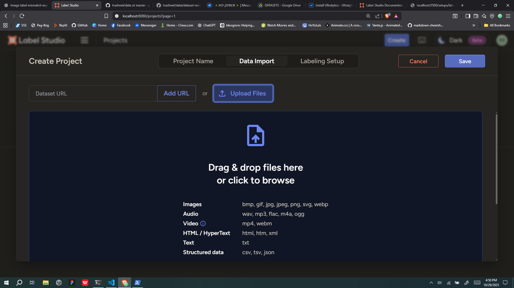
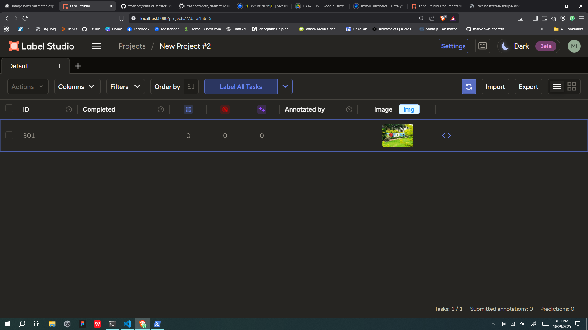
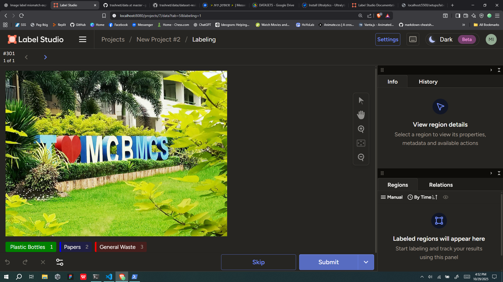
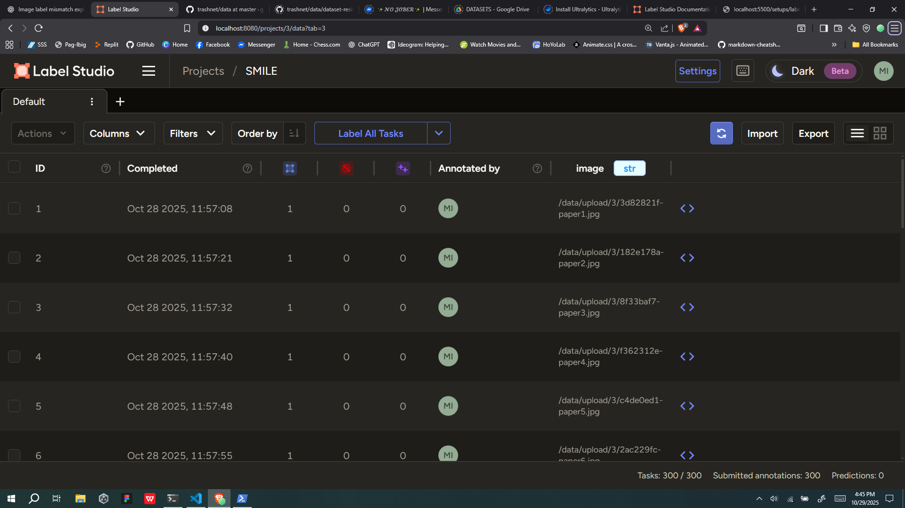
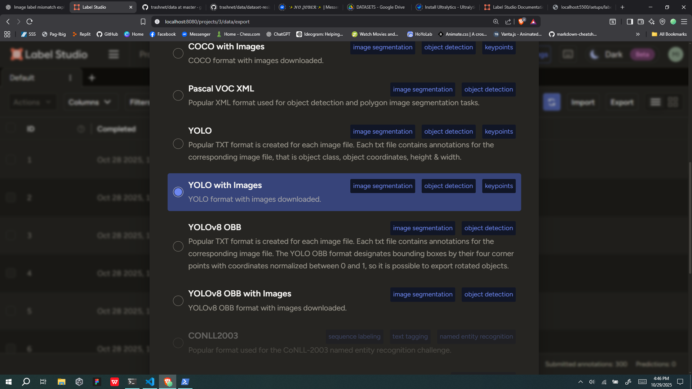
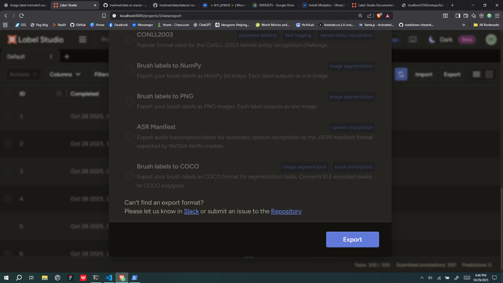

# Setting Up the Label-Studio
This tool will be used to annotate images for A.I. model training.

# :rocket: Procedure
1. Install label-studio using `pip`.
    ```bash
    pip install label-studio
    ```
2. Start / run the label studio.
    ```bash
    label-studio start
    ```
3. Open label-studio at `http://localhost:8080`.
4. Sign up with an email address and password that you create.
5. Click Create to create a project.
    
6. Add project name and labeling setup.
    
    For labeling setup select the `custom template`.
    
    
    Add this code.
    ```svg
    <View>
    <Image name="image" value="$image"/>
    <RectangleLabels name="label" toName="image">
        <Label value="Plastic Bottles" background="green"/>
        <Label value="Papers" background="blue"/>
        <Label value="General Waste" background="red"/>
    </RectangleLabels>
    </View>
    ```
7. Click save and start labeling and annotating images.

# :hammer: To Label / Annotate
1. Make sure the image is been resized to width `512` and height `384`.
2. Import the images using the data import and upload files.
    
3. Click the label all tasks to start labeling the images.
    
4. Click the classe based on the images.
    
    
    
5. Left click and drag to the image and then left click again.
    
6. After labeling click submit.

### `Notes`: 
* To undo labels `Ctrl + Z`.
* To reset / clear the labels, click the `x` button.
    


# :pencil: Optional
* If the port `8080` is in use kindly find and terminate it in powershell running as administrator and run this code.\
    To find the process in the port 8080:
    ```shell
    netstat -ano | findstr :8080
    ```
    To terminate:
    ```shell
    taskkill /PID <taskid> /F
    ```
    Note: Please change the taskid based on the taskid in the netstat

# :package: Exporting
1. Click export.
    
2. Find the `YOLO with Images`.
    
3. Scroll down and click export.
    
4. It will download a `.zip` file and pass it to the google drive of our group.